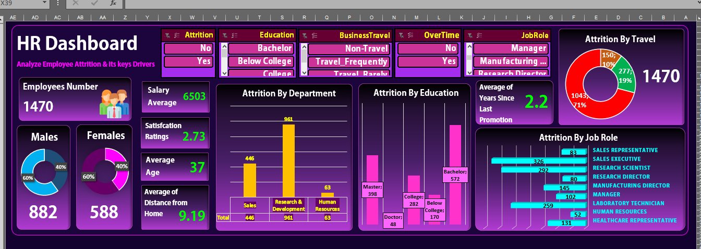

# 📊 Employee Attrition Analysis & Interactive Dashboard

> **Turning employee data into actionable insights with Microsoft Excel.**

An end-to-end **Data Analytics project** focused on analyzing employee attrition patterns and identifying key factors associated with employee turnover.

The project transforms raw employee data into **interactive visual insights** using Excel, enabling users to explore attrition across salary, education, department, job role, business travel, overtime, and promotion-related factors.

**Tech Stack:** `Microsoft Excel` · `Pivot Tables` · `Pivot Charts` · `Slicers` · `Excel Formulas` · `Data Visualization`

## 🎯 Business Problem

Employee attrition can impact workforce stability, productivity, and business costs.
This analysis aims to explore **employee turnover patterns** and identify characteristics and factors associated with employees leaving the company.

## 🔍 Analytical Objectives

* Measure the overall **Attrition Rate**.
* Analyze attrition by **Department** and **Job Role**.
* Compare **Salary levels** of employees who left with the overall workforce.
* Examine the relationship between attrition and **Business Travel**.
* Analyze the impact of **Overtime** on employee turnover.
* Explore attrition patterns across **Education** and **Gender**.
* Investigate the effect of **Distance From Home** and **Years Since Last Promotion**.
* Present the findings through an **interactive Excel Dashboard**.

## 🗂️ Dataset

The dataset contains **1,470 employee records** with demographic, job-related, compensation, satisfaction, and work-related attributes.

### 📌 Data Preparation

The dataset was prepared and structured in **Microsoft Excel** to support reliable analysis and visualization.

Key preparation steps included:

* Reviewing data structure and column types.
* Checking for inconsistencies and data quality issues.
* Organizing employee attributes for analysis.
* Creating analysis-ready tables for **Pivot Tables and Pivot Charts**.
* Applying filters and calculated metrics where required.

## 🛠️ Tools & Analytical Techniques

### Technology

* **Microsoft Excel**

### Data Analysis

* Data Cleaning & Preparation
* Descriptive Analysis
* Comparative Analysis
* Aggregation & KPI Calculation
* Segmentation by Employee Attributes

### Excel Features

* **Pivot Tables** — aggregation and multidimensional analysis
* **Pivot Charts** — visual exploration of attrition patterns
* **Slicers** — interactive filtering
* **Excel Formulas** — calculations and supporting metrics
* **Dashboard Design** — interactive data visualization

### Key Metrics

* Total Employees
* Attrition Count
* Attrition Rate
* Average Monthly Income
* Employee Distribution by Gender
* Attrition by Department & Job Role

## 📈 Key Findings

The analysis revealed several notable patterns among employees who left the company:

| Metric                    |    Finding |
| ------------------------- | ---------: |
| Total Employees           |  **1,470** |
| Employees Who Left        |    **237** |
| Overall Attrition Rate    | **16.12%** |
| Male Employees Who Left   |    **150** |
| Female Employees Who Left |     **87** |
| Bachelor's Degree         |     **99** |
| Master's Degree           |     **58** |

### 🔎 Key Observations

* Employees who left generally had **Monthly Income below the overall average**.
* **Bachelor's degree** was the most common education level among employees who left.
* Attrition was analyzed across **departments and job roles** to identify areas with higher turnover.
* **Business Travel** was examined as a potential factor associated with employee attrition.
* **Overtime** was analyzed to explore its relationship with employee turnover.
* **Years Since Last Promotion** was included to investigate potential patterns related to career progression.
* **Distance From Home** was analyzed to explore whether commuting distance may be associated with attrition.

## 📊 Dashboard & Interactivity

The dashboard was designed to provide a **dynamic and user-friendly analytical experience** using native Excel features.

### Interactive Features

* **Slicers** for dynamic filtering and segmentation.
* **Pivot Charts** that update based on selected filters.
* **Dynamic KPIs** displaying key employee and attrition metrics.
* Interactive analysis of **Department, Job Role, Gender, Business Travel, Overtime, and other employee attributes**.
* Visual comparison between employees who **left** and those who **remained**.

### Dashboard Design

The dashboard follows a clean analytical layout that combines:

**KPIs → Interactive Filters → Visualizations → Insights**

This allows users to move from **high-level workforce metrics** to detailed attrition analysis within a single interactive interface.

## 🖥️ Dashboard Preview

### Main Dashboard



### Attrition Analysis


### Additional Analysis


## 📁 Project Structure

```text
employee-attrition-analysis-excel/
│
├── Employee_Attrition_Dashboard.xlsx
├── README.md
│
└── images/
    ├── dashboard.png
    ├── attrition-analysis.png
    └── attrition-analysis-1.png
```

## 💡 Conclusion

This project demonstrates how **Microsoft Excel can be used as a complete data analytics tool**, from data preparation and exploratory analysis to interactive visualization and insight generation.

The analysis provides a structured view of employee attrition and highlights key areas that can support further investigation into **employee turnover and workforce stability**.

## 👩‍💻 Author

**Hager Mohamed**

**Data Analytics | Excel | SQL | Python | Power BI**

---

⭐ If you find this project useful, feel free to explore the dashboard and analysis.

